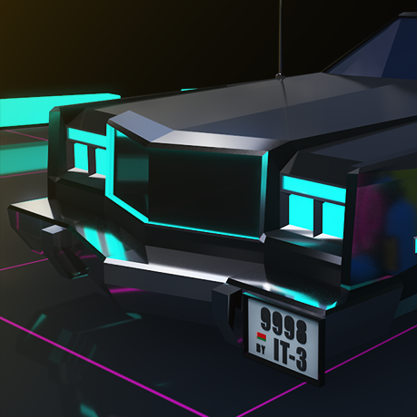
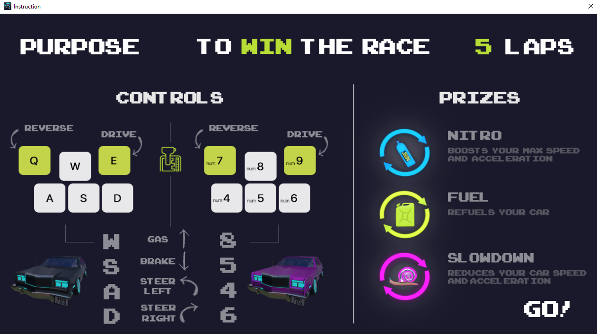

 

  

  <h3 align="center">RetroRace - 2D Topdown Racing</h3>
  

    Built with .NET Framework and OpenGL wrapper (OpenTK).
     
    <a href="https://github.com/StasAndreich/RetroRace-Net-OpenTK-Game/tree/master/RacingGame2D"><strong>Source code »</strong></a>
  

 

  
Table of Contents

  <ol>
    <li>
      <a href="#about-the-project">About The Project</a>
      <ul>
        <li><a href="#built-with">Built With</a></li>
      </ul>
    </li>
    <li>
      <a href="#ingame">InGame</a>
      <ul>
        <li><a href="#game-launcher-screenshot">Game Launcher</a></li>
        <li><a href="#controls-screenshot">Controls</a></li>
        <li><a href="#gameplay-screenshot">Gameplay</a></li>
        <li><a href="#end-of-the-game-screenshot">End of the Game</a></li>
      </ul>
    </li>
    <li><a href="#acknowledgements">Acknowledgements</a></li>
  </ol>

## About The Project
Small Game Development project that includes such processes like:
* Building custom Game Engine with supports 2D-rendering (*based on OpenGL wrapper*) and has an architecture based on 'Components'
* Custom text rendering using pre-created glyphs (OpenTK natively **does not** support text rendering)
* Implementation of basic car physics and movement control
* Custom graphics creation (*basically all 2D sprites are rendered 3D scenes*) using Adobe Photoshop and Cinema4D

### Built With
This project was built using these tools:
* [.NET Framework](https://dotnet.microsoft.com/download/dotnet-framework)
* [OpenTK Library](https://opentk.net/)

## InGame
#### *Game Launcher Screenshot*
 

#### *Controls Screenshot*
 

#### *Gameplay Screenshot*
 

#### *End of the Game Screenshot*
 

## Acknowledgements
* [OpenGL Wiki](https://www.khronos.org/opengl/wiki/)
* [LearnOpenTK](https://opentk.net/learn/index.html)
* [Nystrom, R. Game Programming Patterns](https://www.amazon.com/Game-Programming-Patterns-Robert-Nystrom/dp/0990582906)
* [Gregory, J. Game Engine Architecture](https://www.amazon.com/Engine-Architecture-Third-Jason-Gregory/dp/1138035459)
* [Build your own 2D Game Engine and Create Great Web Games](https://www.amazon.com/Build-Engine-Create-Great-Games/dp/1484209532)
